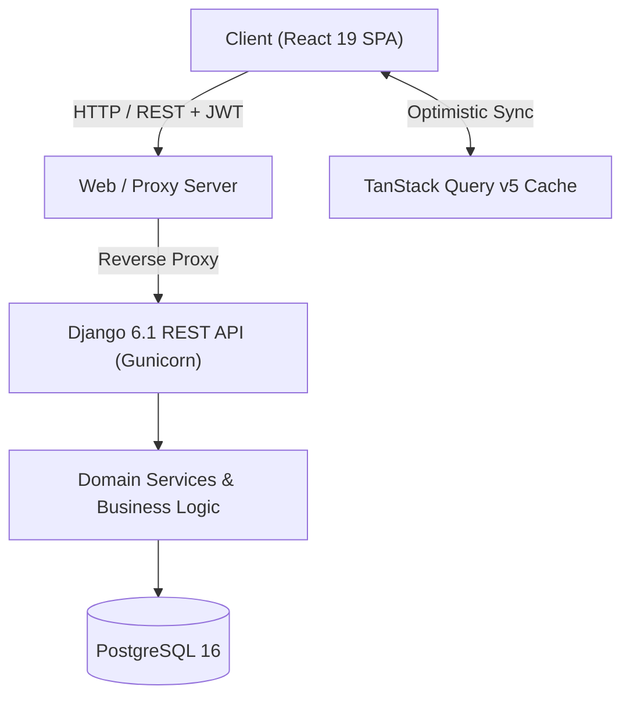

<div align="center">

# 🚀 TaskFlow

### Enterprise-Grade Project Management & Task Orchestration Platform

A high-performance, full-stack task orchestration platform built with **Django 6.1 REST Framework** and **React 19 + TypeScript + Vite + Chakra UI**, backed by **PostgreSQL 16** and powered by **TanStack Query v5** reactive state caching.

[](.github/workflows/ci.yml)
[](https://www.python.org/)
[](https://www.djangoproject.com/)
[](https://react.dev/)
[](https://www.typescriptlang.org/)
[](https://vitejs.dev/)
[](https://www.postgresql.org/)
[](LICENSE)

[Architecture](docs/ARCHITECTURE.md) • [REST API Reference](docs/API.md) • [TanStack Reference](docs/TANSTACK_ARCHITECTURE.md) • [Contributing](CONTRIBUTING.md)

</div>

---

## 📖 Table of Contents

- [Overview](#-overview)
- [System Architecture](#-system-architecture)
- [Key Features](#-key-features)
- [Tech Stack](#-tech-stack)
- [Quick Start Guide](#-quick-start-guide)
  - [Option A: Full-Stack Docker (Recommended)](#option-a-full-stack-docker-compose-recommended)
  - [Option B: Native Local Development](#option-b-native-local-development)
- [Default Seed Credentials](#-default-seed-credentials)
- [Environment Configuration](#-environment-configuration)
- [Automated Testing & Linting](#-automated-testing--linting)
- [Repository Structure](#-repository-structure)
- [API Documentation](#-api-documentation)
- [Contributing](#-contributing)
- [License](#-license)

---

## 🌟 Overview

**TaskFlow** is crafted for engineering teams requiring sub-millisecond perceived latency, robust role-based governance, and real-time state synchronization. It replaces heavy, bloated project management software with a clean, focused **Digital Workroom** architecture.

---

## 🏛 System Architecture



For an in-depth breakdown of the domain layers, state topologies, and database ERD, see the [System Architecture Specification](docs/ARCHITECTURE.md).

---

## ✨ Key Features

### 💻 Modern Frontend (React 19 + TypeScript + Chakra UI)
- **Digital Workroom Design System**: Clean typography with JetBrains Mono metrics, and accessible color scales.
- **Interactive Kanban Board**: Dynamic drag-and-drop task workflows with priority indicator rails (`Low`, `Medium`, `High`) and quick status transitions.
- **Cursor-Based Infinite Scroll**: Infinite task ledgers on the Dashboard and Project views powered by `IntersectionObserver` and TanStack Query `useInfiniteQuery`.
- **Zero-Latency Optimistic Mutations**: Immediate UI cache response on task updates with automatic rollback on network failures.
- **Sprint Velocity Tracker**: Real-time progress calculations showing dynamic velocity copy based on completed tasks.
- **Zero-Dependency JWT Client**: Transparent access token injection and automatic 401 token rotation via refresh cookies/headers.

### ⚙️ Scalable Backend (Django 6.1 + DRF)
- **Clean Layered Architecture**: Strict separation of concerns between `Views`, `Services`, `Serializers`, and `Models`.
- **Cursor & Page-Number Pagination**: Cursor pagination (`TaskCursorPagination`) optimized for high-write tables to prevent data duplication.
- **Role-Based Access Control (RBAC)**: Enforced project ownership (`Owner`) and member collaboration (`Collaborator`) permissions.
- **Auditing & Activity Streams**: Automated lifecycle tracking for task status shifts and reassignments.
- **Observability & Tracing**: Unique `X-Request-ID` request tracing header middleware.
- **Interactive OpenAPI Specification**: Live Swagger UI (`/api/docs/`) and ReDoc (`/api/redoc/`) via `drf-spectacular`.

---

## 🛠 Tech Stack

| Layer | Technologies |
| :--- | :--- |
| **Frontend** | React 19, TypeScript, Vite 8, Chakra UI, Framer Motion, `@dnd-kit`, Lucide Icons |
| **State & Cache**| TanStack Query v5 (`@tanstack/react-query`), `@tanstack/react-query-devtools` |
| **Backend** | Python 3.12, Django 6.1, Django REST Framework (DRF), SimpleJWT, Gunicorn |
| **Database** | PostgreSQL 16 Alpine |
| **Tooling** | UV (Python package management), Oxlint (Linter), Docker, Docker Compose, GitHub Actions |

---

## 🚀 Quick Start Guide

### Option A: Full-Stack Docker Compose (Recommended)

Run the entire application (PostgreSQL, Django API, and React SPA) with a single command:

```bash
# 1. Clone the repository
git clone https://github.com/Vishaldave45/TaskFlow.git
cd TaskFlow

# 2. Start all containers
docker compose up --build -d

# 3. Apply database migrations & seed initial demo data
docker compose exec backend python manage.py migrate
docker compose exec backend python seed_data.py
```

- **Frontend App**: [http://localhost:3000](http://localhost:3000)
- **Backend API**: [http://localhost:8000/api/v1/](http://localhost:8000/api/v1/)
- **Swagger Documentation**: [http://localhost:8000/api/docs/](http://localhost:8000/api/docs/)

---

### Option B: Native Local Development

#### Prerequisites
- **Python 3.12+** with [uv](https://docs.astral.sh/uv/) installed
- **Node.js 20+** & **npm**
- **Docker** (to run the PostgreSQL database)

#### Step 1: Start PostgreSQL
```bash
docker compose up db -d
```

#### Step 2: Set Up Backend
```bash
cd backend

# Install dependencies using uv
uv sync

# Run database migrations
uv run python manage.py migrate

# Seed sample projects, users, and tasks
uv run python seed_data.py

# Start Django development server (Port 8000)
uv run python manage.py runserver
```

#### Step 3: Set Up Frontend
In a new terminal window:
```bash
cd frontend

# Install dependencies
npm install

# Start Vite development server (Port 3000)
npm run dev
```

---

## 🔑 Default Seed Credentials

After running `python seed_data.py`, you can immediately log into the web application using:

| Role | Email | Password | Access Level |
| :--- | :--- | :--- | :--- |
| **Admin / Owner** | `admin@taskflow.dev` | `admin123` | Full workspace governance & superuser |
| **Developer** | `developer@taskflow.dev` | `password123` | Collaborator access across projects |

---

## ⚙️ Environment Configuration

### Backend Environment (`.env`)
Copy the template into `.env` at the project root or inside `backend/`:
```bash
cp .env.example .env
```

| Variable | Description | Default |
| :--- | :--- | :--- |
| `DEBUG` | Django debug mode (`True`/`False`) | `True` |
| `SECRET_KEY` | Cryptographic secret for signing sessions & tokens | Auto-generated dev key |
| `ALLOWED_HOSTS` | Comma-separated list of valid host headers | `localhost,127.0.0.1` |
| `DB_NAME` | PostgreSQL database name | `taskflow` |
| `DB_USER` | PostgreSQL user | `taskflow` |
| `DB_PASSWORD` | PostgreSQL password | `taskflow` |
| `DB_HOST` | Database hostname | `localhost` |
| `DB_PORT` | Database port | `5439` |
| `CORS_ALLOWED_ORIGINS` | Comma-separated allowed CORS origins | `http://localhost:3000,http://localhost:5173` |

### Frontend Environment (`frontend/.env`)
```bash
cp frontend/.env.example frontend/.env
```

| Variable | Description | Default |
| :--- | :--- | :--- |
| `VITE_API_BASE_URL` | Base path for API calls | `/api/v1` (Proxied by Vite to port 8000) |

---

## 🧪 Automated Testing & Linting

TaskFlow maintains strict quality checks across both tiers.

### Backend Tests
```bash
cd backend
uv run pytest
```

### Frontend Typecheck, Lint & Build
```bash
cd frontend
npm run lint    # Runs oxlint across all source files
npm run build   # Type-checks with tsc -b and compiles with Vite
```

### Continuous Integration (CI)
All Pull Requests and commits to `main` are automatically validated via [GitHub Actions](.github/workflows/ci.yml) against PostgreSQL service containers, Python 3.12, and Node.js 20.

---

## 📂 Repository Structure

```
TaskFlow-task/
├── .github/workflows/ci.yml     # Automated CI/CD pipeline
├── backend/                     # Django REST Framework Backend
│   ├── apps/                    # Domain applications (users, projects, tasks, comments, activity)
│   ├── config/                  # Core settings, WSGI, ASGI & URL router
│   ├── core/                    # Middleware (tracing), pagination & exception handling
│   ├── Dockerfile               # Production container definition
│   ├── pyproject.toml           # UV dependencies & Ruff linting configuration
│   └── seed_data.py             # Database seeder script
├── frontend/                    # React 19 + Vite Frontend SPA
│   ├── src/
│   │   ├── api/                 # Fetch HTTP client with JWT auto-refresh
│   │   ├── components/          # Shared design system components & layout
│   │   ├── features/            # Feature modules (projects, tasks)
│   │   ├── lib/                 # QueryClient singleton & queryKeys
│   │   ├── pages/               # Application route views
│   │   └── theme/               # Chakra UI design tokens
│   ├── Dockerfile               # Multi-stage production container
│   ├── nginx.conf               # Web server configuration for SPA routing
│   └── package.json             # NPM dependencies & scripts
├── docs/                        # In-depth architectural & API specifications
│   ├── ARCHITECTURE.md          # Domain layers, data flow & ERD
│   ├── API.md                   # REST API documentation & endpoint schemas
│   └── TANSTACK_ARCHITECTURE.md # TanStack Query v5 state management reference
├── docker-compose.yml           # Full-stack container orchestration
├── .env.example                 # Root environment template
├── CONTRIBUTING.md              # Contributor guidelines
└── README.md                    # Project landing & guide
```

---

## 📡 API Documentation

Interactive OpenAPI documentation is hosted by the running backend server:
- **Swagger UI**: [http://localhost:8000/api/docs/](http://localhost:8000/api/docs/)
- **ReDoc**: [http://localhost:8000/api/redoc/](http://localhost:8000/api/redoc/)
- For full endpoint tables and schemas, consult [docs/API.md](docs/API.md).

---

## 🤝 Contributing

Contributions are welcome! Please read [CONTRIBUTING.md](CONTRIBUTING.md) for details on our code of conduct, development workflow, branch naming standards, and pull request checklist.

---

## 🛡️ License

This project is licensed under the **MIT License** — see the [LICENSE](LICENSE) file for details. Built with ❤️ for productive engineering teams.
