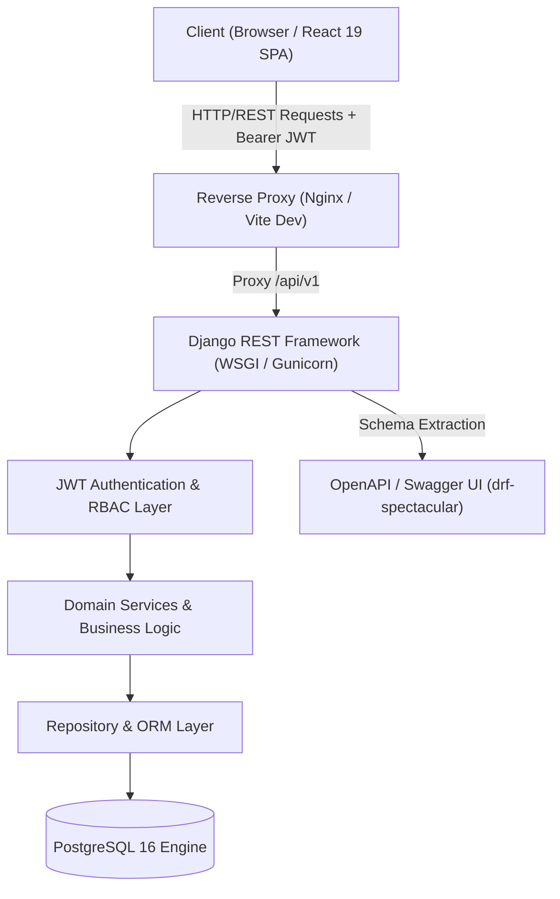
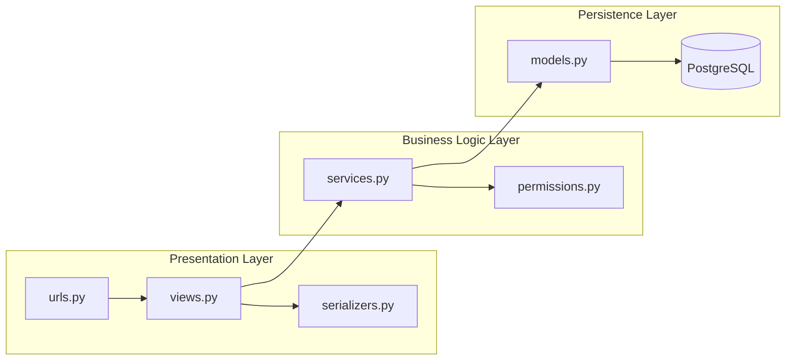
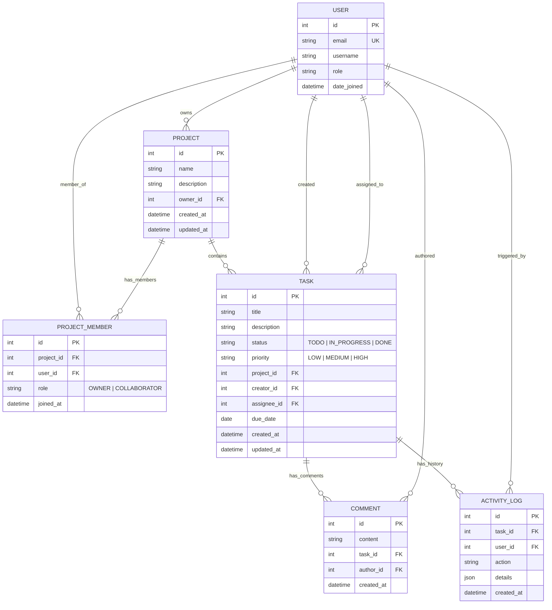
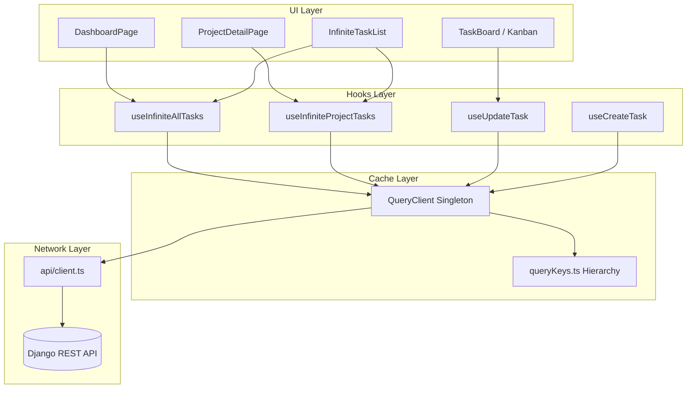
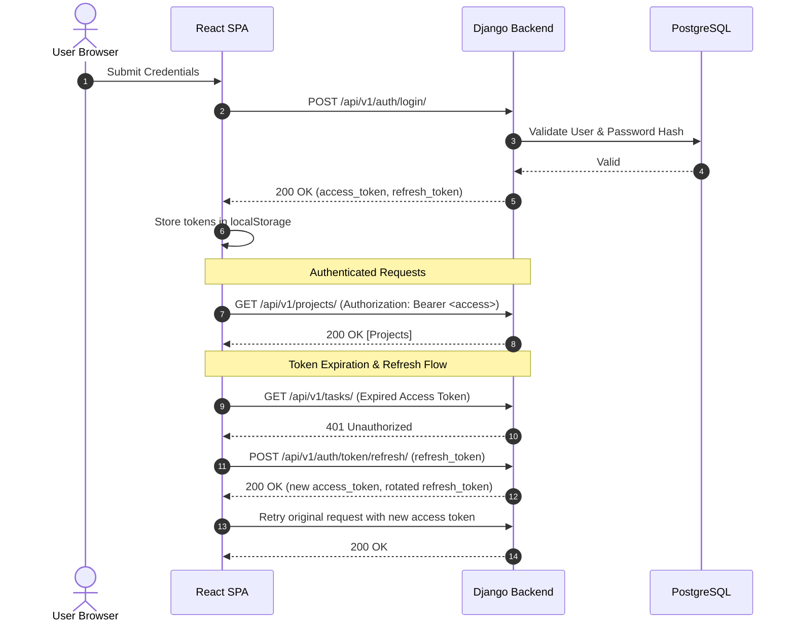

# 🏛️ TaskFlow — System Architecture & Design Specification

This document provides a comprehensive technical reference for the architecture, data models, state topologies, and security boundaries of the **TaskFlow** platform.

---

## 1. High-Level System Architecture

TaskFlow is designed as a decoupled, full-stack application following a modern API-first paradigm.



---

## 2. Monorepo Directory Organization

```
TaskFlow-task/
├── .github/
│   └── workflows/
│       └── ci.yml             # Automated CI pipeline (Django + React)
├── backend/                   # Django REST Framework Backend
│   ├── apps/
│   │   ├── users/             # Custom User model, JWT auth & profile
│   │   ├── projects/          # Projects, membership & RBAC
│   │   ├── tasks/             # Task CRUD, statuses, priorities & cursor pagination
│   │   ├── comments/          # Task threaded comments
│   │   └── activity/          # Automated audit logging
│   ├── config/                # Django core settings, WSGI, ASGI, Root URLs
│   ├── core/                  # Shared middleware, pagination & exception handlers
│   ├── manage.py
│   ├── pyproject.toml         # UV/PEP-518 dependencies & Ruff config
│   └── Dockerfile             # Multi-stage production container
├── frontend/                  # React 19 + TypeScript + Vite SPA
│   ├── src/
│   │   ├── api/               # Fetch HTTP client, JWT auto-refresh & API endpoints
│   │   ├── components/        # Layout, Navbar, Modal & UI design system
│   │   ├── context/           # AuthContext & Session management
│   │   ├── features/          # Feature slices: projects, tasks, auth
│   │   │   ├── projects/      # Project hooks & components
│   │   │   └── tasks/         # Kanban board, InfiniteTaskList, TaskCard, modals
│   │   ├── lib/               # QueryClient singleton & centralized queryKeys
│   │   ├── pages/             # Route views (Dashboard, Projects, ProjectDetail)
│   │   ├── theme/             # Chakra UI tokens, fonts & color scales
│   │   └── types/             # Shared TypeScript type contracts
│   ├── nginx.conf             # Production SPA web server configuration
│   ├── package.json
│   ├── tsconfig.json
│   └── Dockerfile             # Multi-stage Node 20 + Nginx container
├── docs/                      # Architecture, API guides & implementation references
├── docker-compose.yml         # Full-stack container orchestration
├── .env.example               # Backend environment variable template
├── CONTRIBUTING.md            # Contribution guidelines & code standards
└── README.md                  # Project landing, quick start & documentation
```

---

## 3. Backend Architecture: Clean Layered Pattern

The Django backend enforces a strict separation of concerns to avoid bloated models or controllers:



1. **Views (`views.py`)**: Responsible solely for request parsing, status codes, view-level permissions, and delegating to services.
2. **Serializers (`serializers.py`)**: Handles data validation, deserialization, and representation.
3. **Services (`services.py`)**: Encapsulates business logic, state transitions, domain-level validation, and side effects (e.g., creating `ActivityLog` entries).
4. **Permissions (`permissions.py`)**: Granular authorization (e.g., `IsProjectOwner`, `IsProjectMember`).
5. **Models (`models.py`)**: Database definitions with database constraints, indexes, and relations.

---

## 4. Entity Relationship Diagram (ERD)



---

## 5. Frontend Architecture & State Topology

TaskFlow uses **TanStack Query v5** for server-state caching and synchronization.



### 5.1 Query Keys Hierarchy (`src/lib/queryKeys.ts`)
```typescript
queryKeys = {
  projects: {
    all: ['projects'],
    list: () => ['projects', 'list'],
    detail: (id) => ['projects', 'detail', id],
    members: (id) => ['projects', id, 'members'],
  },
  tasks: {
    all: ['tasks'],
    list: () => ['tasks', 'list'],
    infiniteList: () => ['tasks', 'infinite'],
    projectList: (projectId) => ['tasks', 'project', projectId],
    projectInfiniteList: (projectId) => ['tasks', 'project', projectId, 'infinite'],
    detail: (id) => ['tasks', 'detail', id],
    comments: (taskId) => ['tasks', taskId, 'comments'],
    activity: (taskId) => ['tasks', taskId, 'activity'],
  }
}
```

### 5.2 Optimistic Mutation Flow
When a task status is changed via the Kanban board or Infinite List:
1. `onMutate`: Inactive network queries are cancelled. Previous task cache is snapshotted. The local cache is updated immediately.
2. `onError`: If the HTTP PATCH fails, the cache is rolled back to the previous snapshot, and an error toast is surfaced.
3. `onSettled`: Relevant query keys (`['tasks']`) are invalidated in the background to ensure consistency with the database.

---

## 6. Authentication & Security Model



### Role-Based Access Control (RBAC) Matrix

| Resource / Action | Anonymous | Collaborator | Project Owner | System Admin |
| :--- | :---: | :---: | :---: | :---: |
| Register / Login | ✅ | ✅ | ✅ | ✅ |
| View Owned/Member Projects | ❌ | ✅ | ✅ | ✅ |
| Create Project | ❌ | ✅ | ✅ | ✅ |
| Update Project Metadata | ❌ | ❌ | ✅ | ✅ |
| Delete Project | ❌ | ❌ | ✅ | ✅ |
| Invite / Remove Members | ❌ | ❌ | ✅ | ✅ |
| View Project Tasks | ❌ | ✅ | ✅ | ✅ |
| Create / Update Tasks | ❌ | ✅ | ✅ | ✅ |
| Delete Tasks | ❌ | Creator Only | ✅ | ✅ |
| Post / Delete Comments | ❌ | Author Only | ✅ | ✅ |
| View Activity Audit Log | ❌ | ✅ | ✅ | ✅ |

---

## 7. Tracing & Error Handling

- **Request ID Tracing**: Every inbound request is assigned a unique `X-Request-ID` via `core.middleware.RequestIDMiddleware` which is logged and returned in the HTTP response headers.
- **Standardized Error Envelope**:
  ```json
  {
    "error": {
      "code": "PERMISSION_DENIED",
      "message": "You must be the project owner to perform this action.",
      "details": {}
    }
  }
  ```
